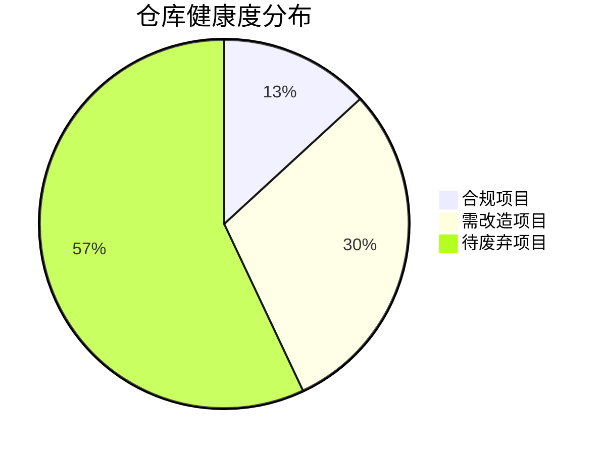
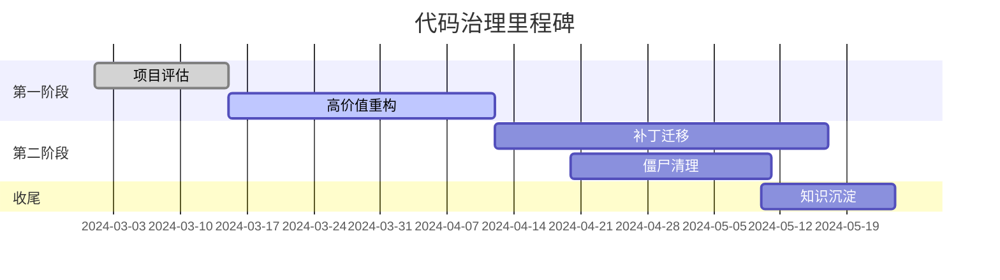
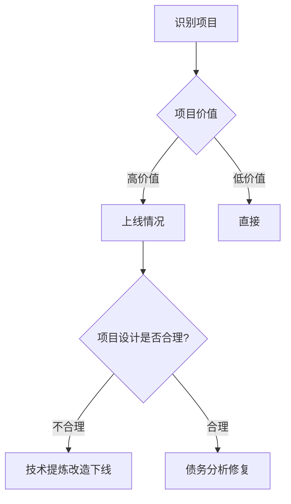
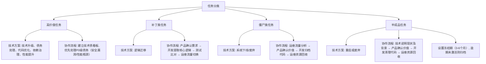
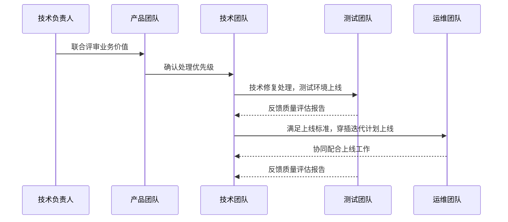
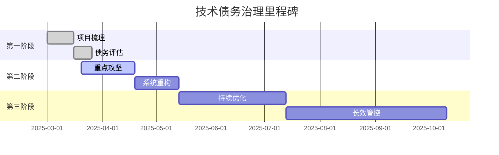
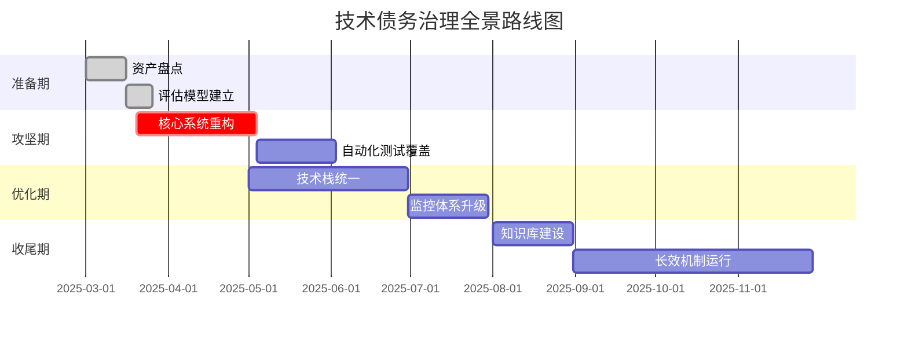
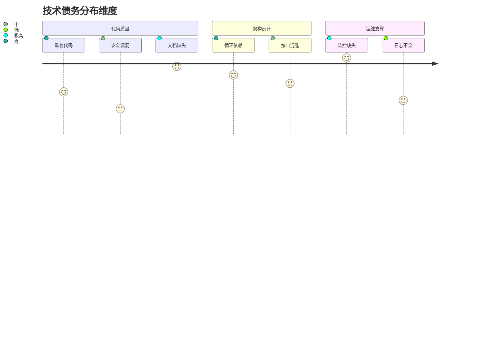

---
{"aliases":null,"created":"Tuesday, March 31st 2026, 3:07:07 pm","modified":"Saturday, April 4th 2026, 3:03:57 pm","dg-publish":true,"tags":["Software","1-Areas"],"related":"","author":"Gavin","permalink":"/03-Software & Tools/Mermaid 示例/","dgPassFrontmatter":true,"dg-note-properties":{"aliases":null,"created":"Tuesday, March 31st 2026, 3:07:07 pm","modified":"Saturday, April 4th 2026, 3:03:57 pm","tags":["Software","1-Areas"],"related":"","author":"Gavin"}}
---

