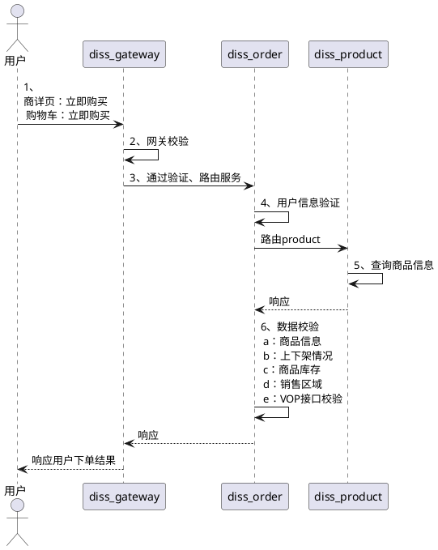
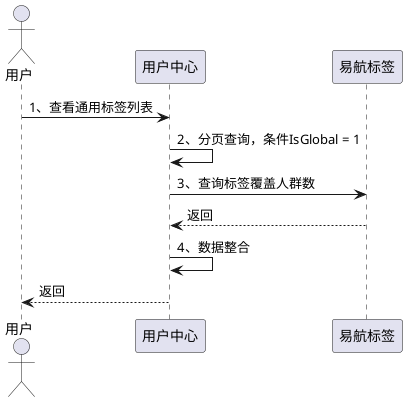
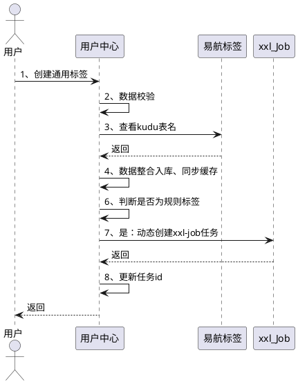
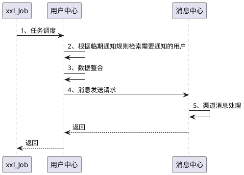
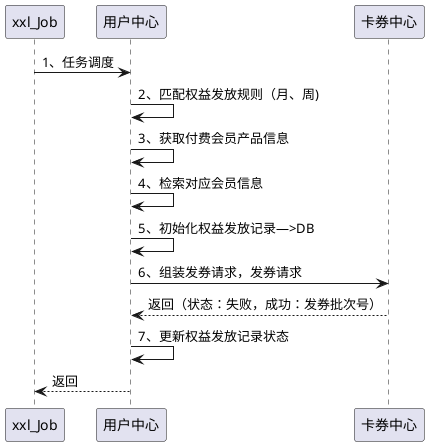
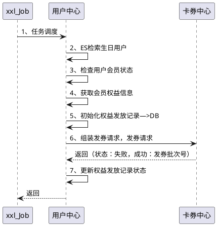
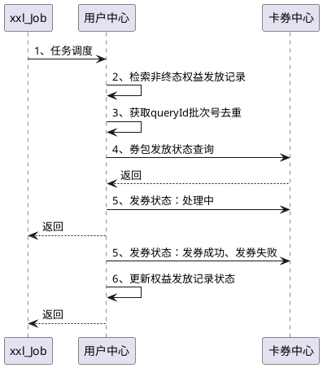
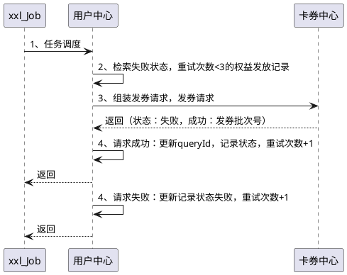

---
{"aliases":null,"created":"Tuesday, March 31st 2026, 3:12:53 pm","modified":"Saturday, April 4th 2026, 2:18:10 pm","dg-publish":true,"tags":["domain/software","domain/tool","domain/draw"],"related":"","author":"Gavin","permalink":"/03-Software & Tools/PlantUML - 时序图示例/","dgPassFrontmatter":true,"dg-note-properties":{"aliases":null,"created":"Tuesday, March 31st 2026, 3:12:53 pm","modified":"Saturday, April 4th 2026, 2:18:10 pm","tags":["domain/software","domain/tool","domain/draw"],"related":"","author":"Gavin"}}
---


## 示例

```plantuml
Bob -> Alice : hello
Alice -> Wonderland: hello
Wonderland -> next: hello
next -> Last: hello
Last -> next: hello
next -> Wonderland : hello
Wonderland -> Alice : hello
Alice -> Bob: hello
```







临期提醒



定时券包



生日券包



异步查询发券结果



发券补偿


