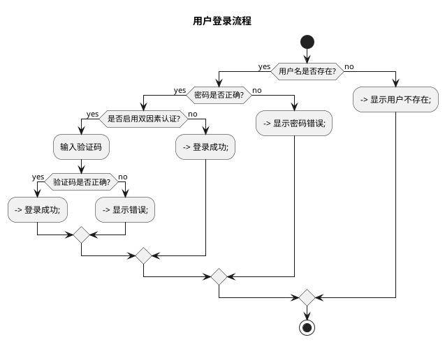
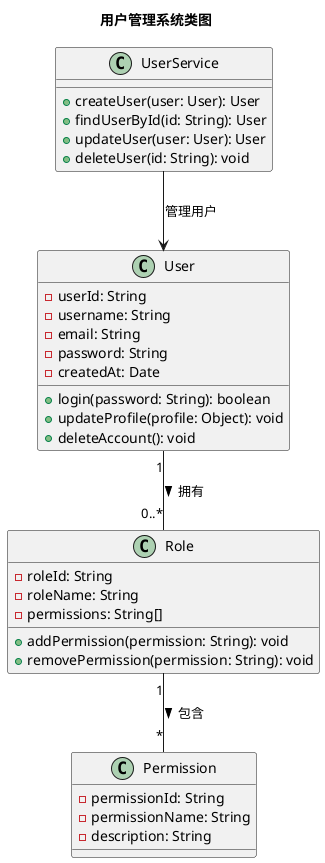
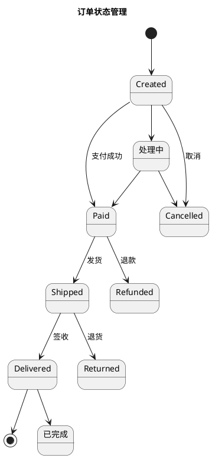
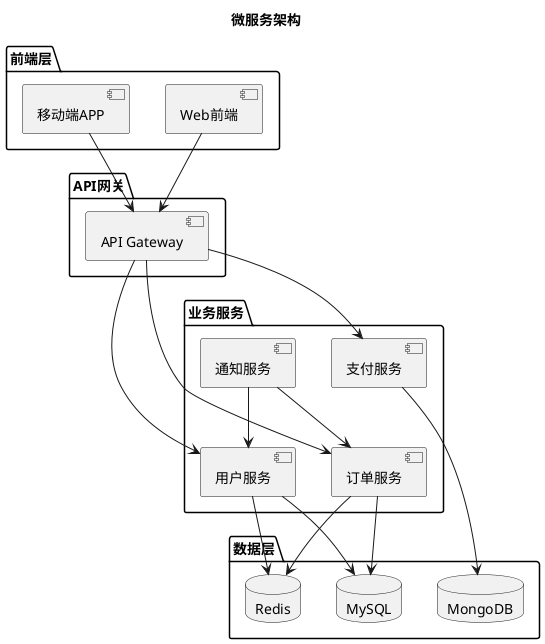
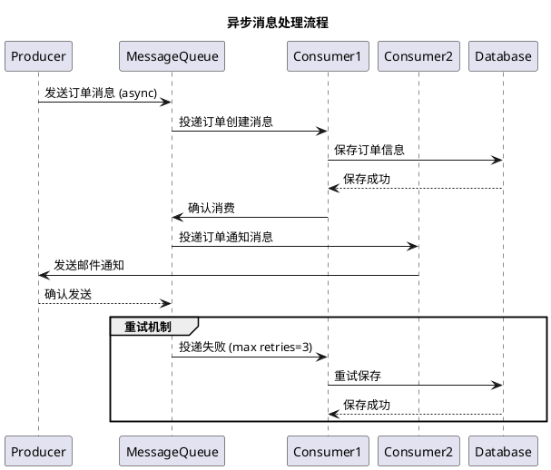

---
{"aliases":["plantuml","diagram-tool","uml-diagrams"],"created":"Saturday, April 4th 2026, 2:15:00 pm","modified":"Saturday, April 4th 2026, 2:17:06 pm","dg-publish":true,"tags":["domain/software","domain/tool"],"related":["200_Areas/200_实用指南/208_Software/kitty.md"],"author":"Gavin","permalink":"/03-Software & Tools/PlantUML - 编程开发示例/","dgPassFrontmatter":true,"dg-note-properties":{"aliases":["plantuml","diagram-tool","uml-diagrams"],"created":"Saturday, April 4th 2026, 2:15:00 pm","modified":"Saturday, April 4th 2026, 2:17:06 pm","tags":["domain/software","domain/tool"],"related":["200_Areas/200_实用指南/208_Software/kitty.md"],"author":"Gavin"}}
---


## 活动图 - 用户登录流程



## 序列图 - REST API 调用

```plantuml
@startuml
title REST API 请求处理

participant Client
participant LoadBalancer
participant APIGateway
AuthService
UserService
Database

Client -> LoadBalancer: HTTP POST /api/users
LoadBalancer -> APIGateway: 转发请求
APIGateway -> AuthService: 验证Token
AuthService --> APIGateway: 验证成功
APIGateway -> UserService: 处理请求
UserService -> Database: 查询数据
Database --> UserService: 返回数据
UserService --> APIGateway: 返回响应
APIGateway --> LoadBalancer: 返回响应
LoadBalancer --> Client: HTTP 200 OK
@enduml
```

## 类图 - 用户管理系统



## 状态图 - 订单状态管理



## 组件图 - 微服务架构



## 对象图 - 购物车示例

```plantuml
@startuml
title 购物车对象示例

object user1 {
  userId = "1001"
  username = "张三"
  email = "zhangsan@example.com"
}

object cart1 {
  cartId = "cart_2001"
  userId = "1001"
  items = [
    { productId: "P001", name: "笔记本电脑", quantity: 1, price: 5999 },
    { productId: "P002", name: "无线鼠标", quantity: 2, price: 199 }
  ]
  totalAmount = 6397
}

object product1 {
  productId = "P001"
  name = "笔记本电脑"
  price = 5999
  stock = 100
}

object product2 {
  productId = "P002"
  name = "无线鼠标"
  price = 199
  stock = 500
}

user1 "拥有" --> cart1
cart1 "包含" product1
cart1 "包含" product2
@enduml
```

## 时序图 - 异步消息处理



## 部署图 - Docker 容器部署

```plantuml
@startuml
title Docker 容器部署

node "服务器" {
  database "MySQL:8.0" {
    port 3306
    volume /var/lib/mysql
  }

  database "Redis:6.2" {
    port 6379
    volume /data
  }

  container "Web App" {
    port 8080
    env SPRING_PROFILES=prod
    links MySQL, Redis
    depends_on MySQL
  }

  container "Nginx" {
    port 80, 443
    links Web App
    depends_on Web App
  }

  container "Log Aggregator" {
    port 514
    depends_on Web App
  }
}

node "监控服务器" {
  container "Prometheus" {
    port 9090
  }

  container "Grafana" {
    port 3000
  }

  Prometheus --> Web App : 监控指标
  Prometheus --> MySQL : 监控指标
  Grafana --> Prometheus : 数据可视化
}

node "开发环境" {
  container "开发容器" {
    port 3000
    env SPRING_PROFILES=dev
  }
}
@enduml
```

## 甘特图 - 项目开发进度

```plantuml
@startuml
title 项目开发进度甘特图

skinparam gantt {
  dateFormat        YYYY-MM-DD
  rowHeight        30
  gridInvisible    false
  today            2024-01-15
}

|需求分析|设计|开发|测试|部署|
[需求分析] as (req) 2024-01-01 - 2024-01-15
[UI设计] as (ui) 2024-01-10 - 2024-01-25
[数据库设计] as (db) 2024-01-15 - 2024-01-20
[后端开发] as (backend) 2024-01-20 - 2024-02-20
[前端开发] as (frontend) 2024-01-20 - 2024-02-15
[单元测试] as (unit) 2024-02-10 - 2024-02-25
[集成测试] as (int) 2024-02-20 - 2024-03-05
[用户验收测试] as (uat) 2024-02-25 - 2024-03-10
[生产部署] as (prod) 2024-03-10 - 2024-03-15

' 依赖关系
req -> ui
req -> db
db -> backend
db -> frontend
backend -> unit
frontend -> unit
unit -> int
int -> uat
uat -> prod

' 今日线
todayline -> req :
@enduml
```
